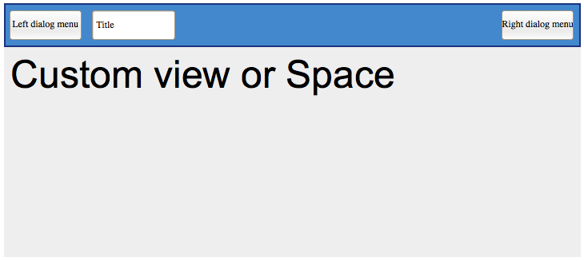
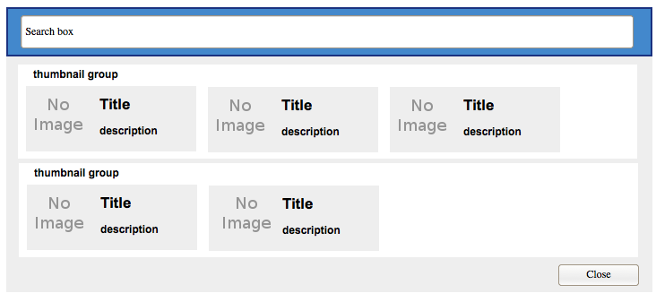
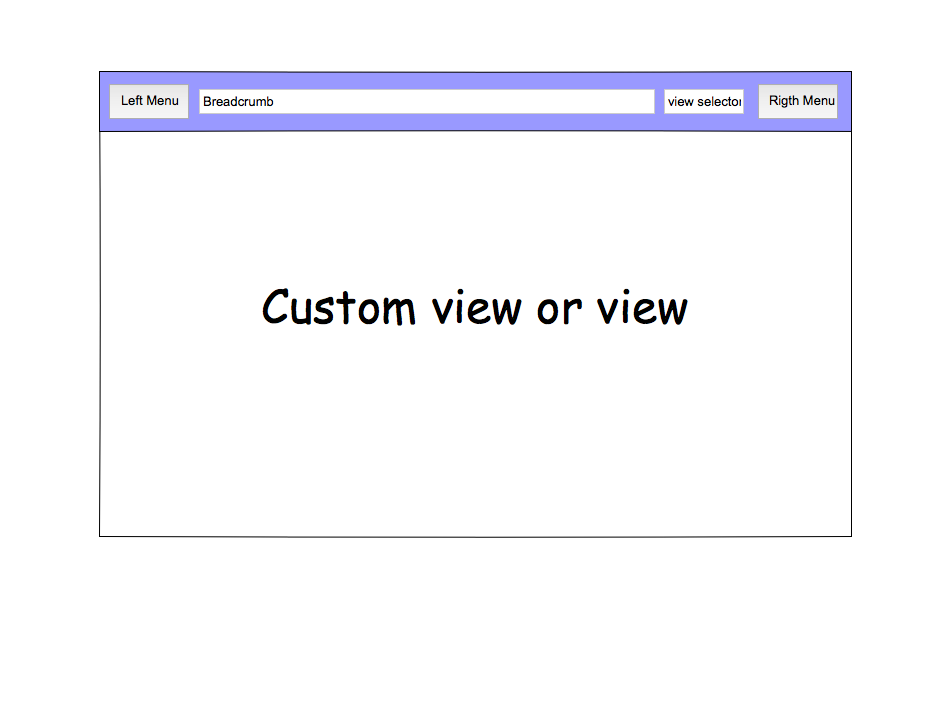
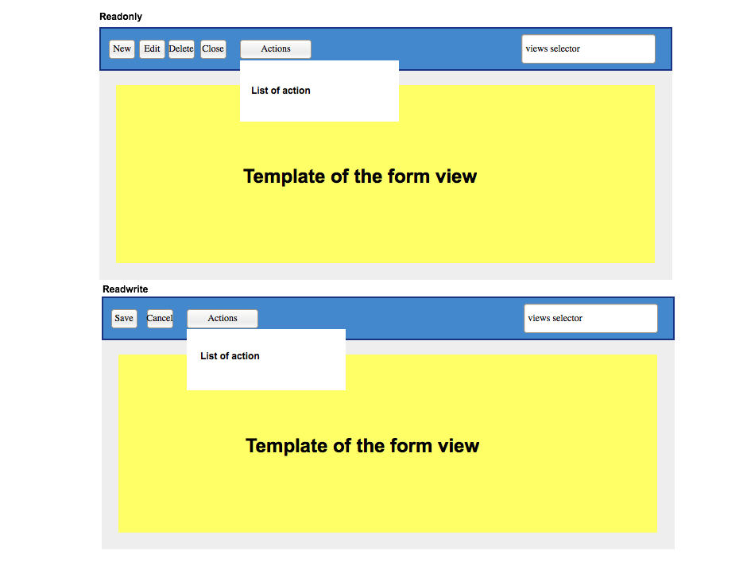
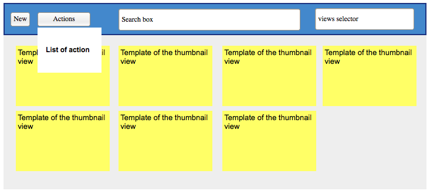
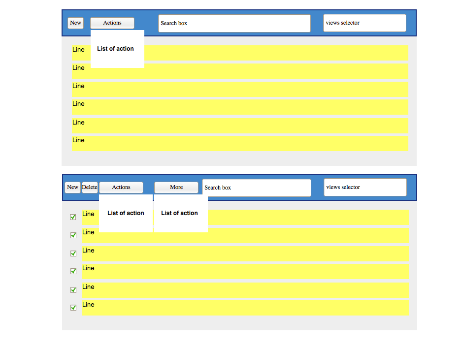

.. This file is a part of the FuretUI project                                   
..
..    Copyright (C) 2014 Jean-Sebastien SUZANNE <jssuzanne@anybox.fr>
..
.. This Source Code Form is subject to the terms of the Mozilla Public License,
.. v. 2.0. If a copy of the MPL was not distributed with this file,You can
.. obtain one at http://mozilla.org/MPL/2.0/.

.. contents::

API
===

APP
---

Render the application, need the providers for theme and redux storage

|app|

::

    <furet-ui />

Right and Left Menu
-------------------

It is a Modal menu. It is a thumbnail render, the thumbnail can be filtered by a searchBox

|dialog|

::

    <furet-ui-appbar-left-menu />
    <furet-ui-appbar-right-menu />

Space
-----

A space is an environnement for a specific behavior. Each space can defined menus, actions, views

|space|

::

    <furet-ui-space 
        v-bind:spaceId="..." 
        v-bind:menuId="..." 
        v-bind:actionId="..." 
        v-bind:viewId="..." 
    />

Picture
-------

Render a picture, the picture can be come from:

* font-icon: font-awesome class

::

    <furet-ui-picture type="font-icon" value="fa-user" />

Views
-----

List the type of view available for the server.

The view type can be:

* standard: List, Form, Thumbnail
* custom: Login, Logout

All the view are present in the plugin system of FuretUI.

Unknown
~~~~~~~

Replace the wanted view if no view are available

List
~~~~

Render a list of data

|list_view|

Form
~~~~

Render a react template, the template come from serveur and stock in the redux store

|form_view|

Thumbnail
~~~~~~~~~

Render a react template, the template come from serveur and stock in the redux store

|thumbnail_view|

Field
-----

Each field must be defined by views type. 

Simple
~~~~~~

The list are:

* Boolean
* Color
* Date
* DateTime
* Float
* Integer
* JSON
* File
* Password
* Selection
* String
* Text
* Time
* URL

Relation ship
~~~~~~~~~~~~~

Relation ship are particular field which link two model.

The list are:

* Many2One
* Many2Many 
    - List, 
    - Thumbnail
    - Form
        * checkbox
        * tags
* One2Many

Plugin
------

It is not a composent, it allow to save some function / object / class. This function / object / class
are used and can be overwrite easily to change the behavior.

::

    import plugin from './plugin';

    const func = (props) => {...}
    plugin(['path', 'to', 'save', 'in', 'plugin'], {Hello: func});

    plugin.get(['path', 'to', 'save', 'in', 'plugin', 'Hello']);

