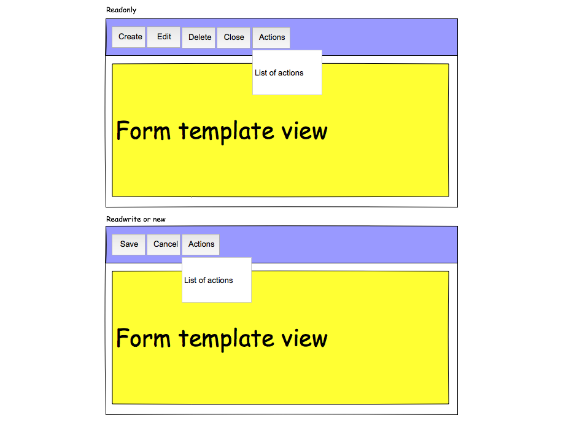
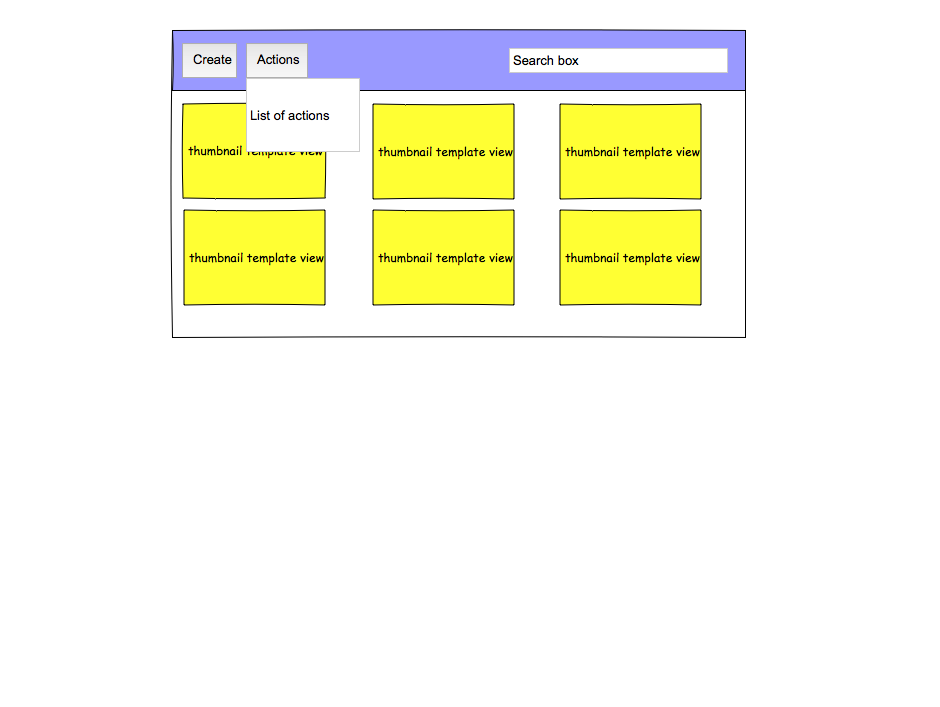
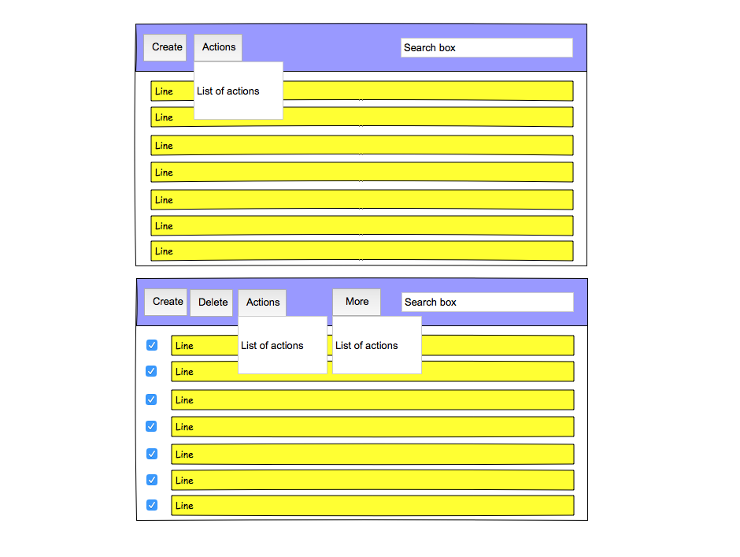

.. This file is a part of the FuretUI project                                   
..
..    Copyright (C) 2014 Jean-Sebastien SUZANNE <jssuzanne@anybox.fr>
..
.. This Source Code Form is subject to the terms of the Mozilla Public License,
.. v. 2.0. If a copy of the MPL was not distributed with this file,You can
.. obtain one at http://mozilla.org/MPL/2.0/.

API
===

APP
---

Render the application, need the providers for theme and redux storage

|app|

::

    import App from './app':
    
    <Provider store={store}>
        <MuiThemeProvider muiTheme={getMuiTheme(lightBaseTheme)}>
            <App />
        </MuiThemeProvider>
    </Provider>

..warning::

    All the component under App need to be under the provider.

Right and Left Menu
-------------------

It is a Modal menu. It is a thumbnail render, the thumbnail can be filtered by a searchBox

|dialog|

::

    import {LeftMenu, RightMenu} from './menus'

    <LeftMenu />
    <RightMenu />

Space
-----

A space is an environnement for a specific behavior. Each space can defined menus, actions, views

::

    import Space from './space';

    <Space spaceId={spaceId (string, required)} />

ActionManager
-------------

Display left / rigth menu from space and add breadcrum.

|action_manager|

The breadcrum is a set of current actions

This composant is connected at Redux with the state ``action_manager``.

::

    import {ActionManager} from './action';

    <ActionManager 
        actionId={actionId (string, required)} 
        left_menu={left_menu (icon button or icon menu or icon drawer)}
        rigth_menu={rigth_menu (icon button or icon menu or icon drawer)}
    />

Action
------

Render one action and on view

::

    import {Action} from './action';

    <Action
        actionId={actionId (string, required)}
        model={model (string)}
        viewId={viewId (string)}
        views={[{actionId (string, required), viewId (string, required)}, ...]}
        disabled={disabled (boolean)}
    />

Picture
-------

Render a picture, the picture can be come from:

* svg-icon: Material design icon
* font-icon: font-awesome class

::

    import {Picture} from './picture';

    <Picture type="font-icon" value="fa-user" iconSize="fa-3x" />
    or
    <Picture type="svg-icon" value="ActionAndroid" style={{height: 48, width: 48}} />

Views
-----

List the type of view available for the server.

The view type can be:

* standard: List, Form, Thumbnail
* custom: Login, Logout

All the view are present in the plugin system of FuretUI.

the methods:

* getClientView(viewName): return the custom view component
* getViewIcon(type, onClick): return the icon of the view to add it in the selector
* getView(type, viewId, params): return the standard view

Unknown
~~~~~~~

Replace the wanted view if no view are available

List
~~~~

Render a list of data

|list_view|

::

    import {getView} from './views':

    getView('List', viewId (string), {ids: [dataId (string)]})

Form
~~~~

Render a react template, the template come from serveur and stock in the redux store

|form_view|

::

    import {getView} from './views':

    getView('Form', viewId (string), {id: dataId (string), readonly: readonly (boolean)})

Thumbnail
~~~~~~~~~

Render a react template, the template come from serveur and stock in the redux store

|thumbnail_view|

::

    import {getView} from './views':

    getView('Thumbnail', viewId (string), {ids: [dataId (string)]})

Field
-----

Each field must be defined by views type. The list views are:

* BigInteger
* Boolean
* Color
* Date
* DateTime
* Decimal
* Float
* Integer
* Password
* Selection
* Sequence
* SmallInteger
* String
* Text
* Time
* uString
* uText
* URL
* UUID

::

    import {getField} from './fields';

    getField(viewType (string), fieldType (string), params (object), value)

Plugin
------

It is not a composent, it allow to save some function / object / class. This function / object / class
are used and can be overwrite easily to change the behavior.

::

    import plugin from './plugin';

    const func = (props) => {return 'Hello'}
    plugin(['path', 'to', 'save', 'in', 'plugin'], {Hello: func});

    plugin.get(['path', 'to', 'save', 'in', 'plugin', 'Hello']);

.. |action_manager| image:: _static/api/action_manager.png
    :alt: Action manager

.. |app| image:: _static/api/app.png
    :alt: App

