.. This file is a part of the FuretUI project                                   
..
..    Copyright (C) 2016 Jean-Sebastien SUZANNE <jssuzanne@anybox.fr>
..
.. This Source Code Form is subject to the terms of the Mozilla Public License,
.. v. 2.0. If a copy of the MPL was not distributed with this file,You can
.. obtain one at http://mozilla.org/MPL/2.0/.

Some picture
============

|app_0|

|app_1|

|app_2|

|app_3|

|app_4|

|app_5|

|app_6|

|app_7|

|app_8|

|app_9|

|app_9|

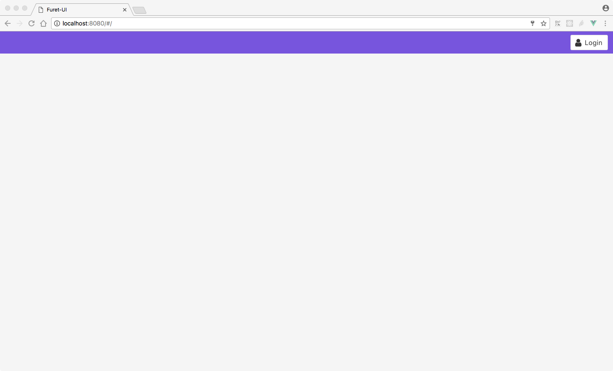
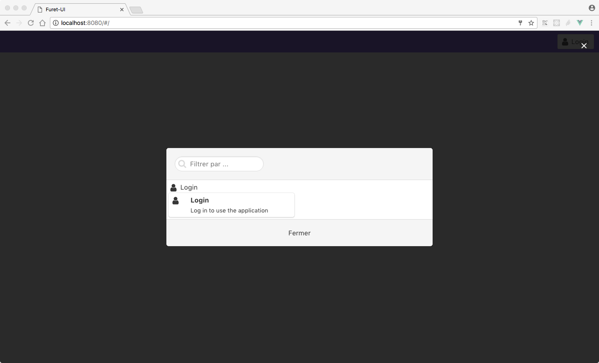
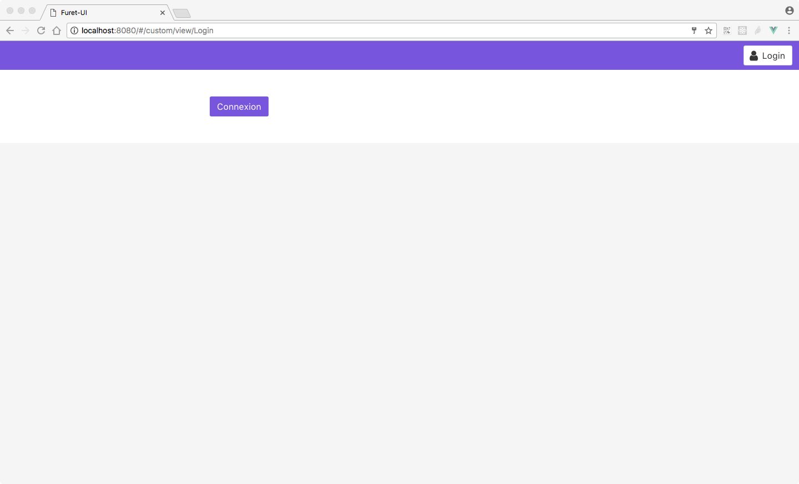
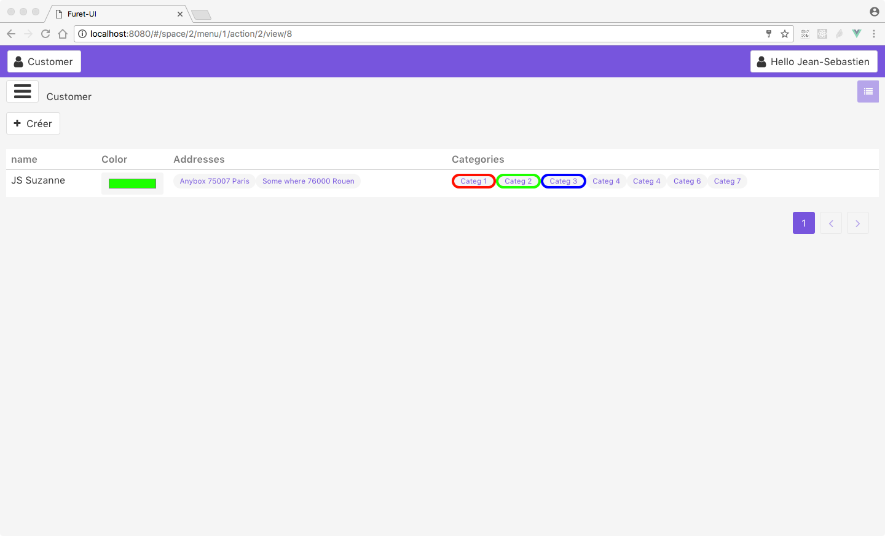
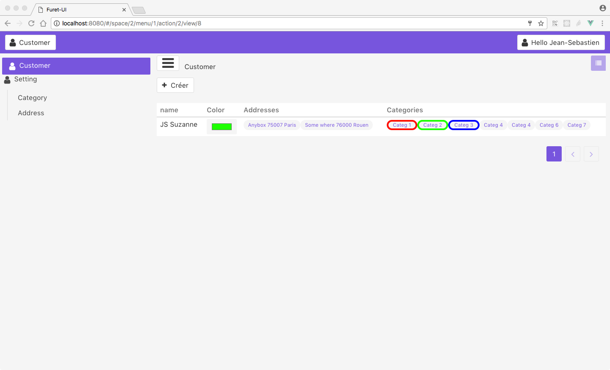
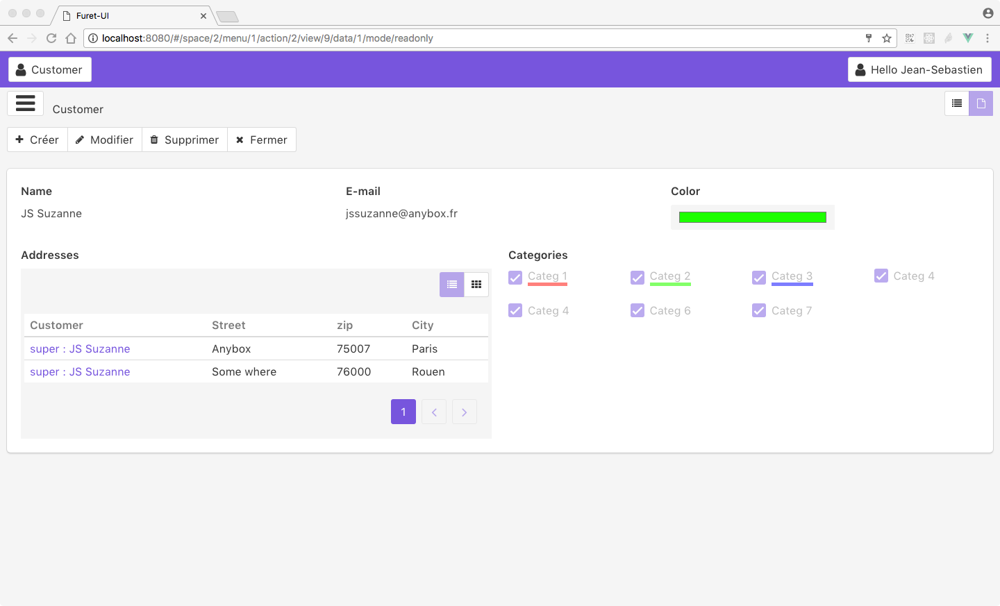
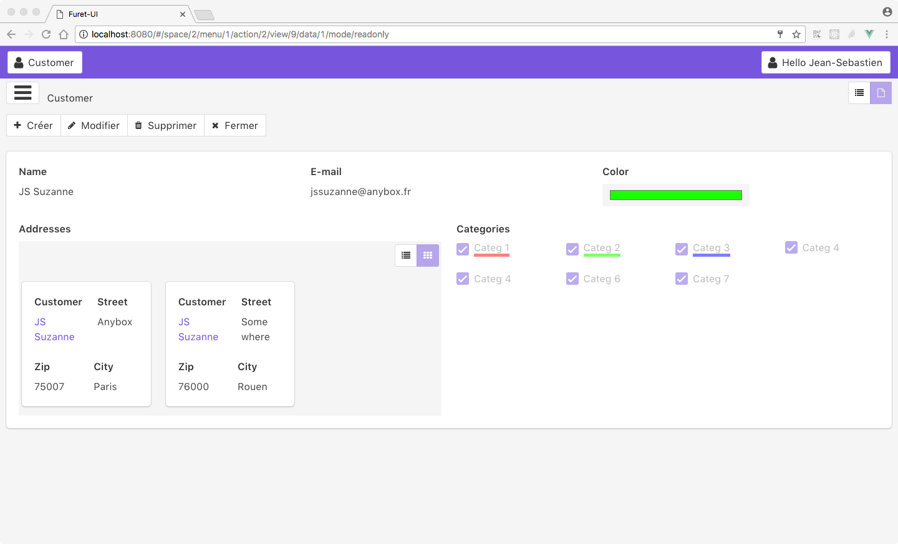
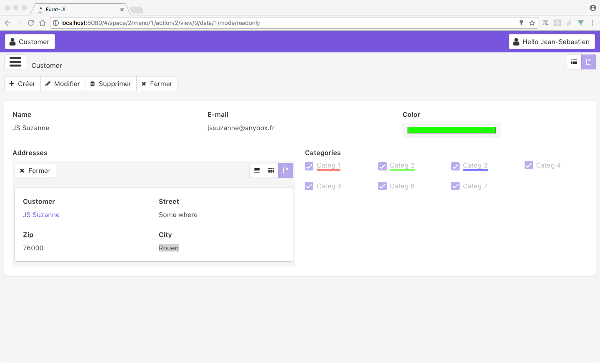
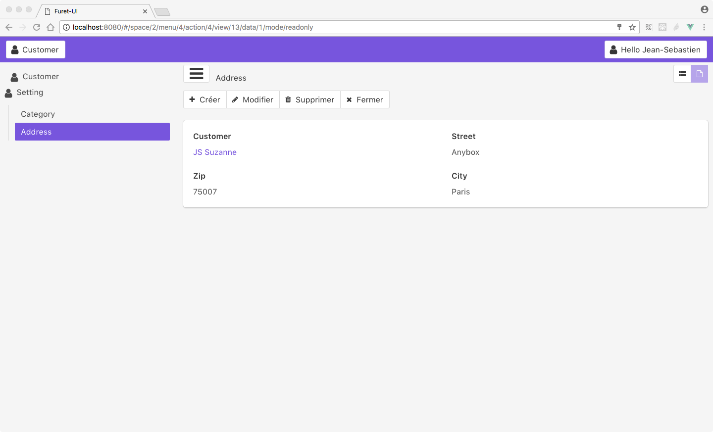
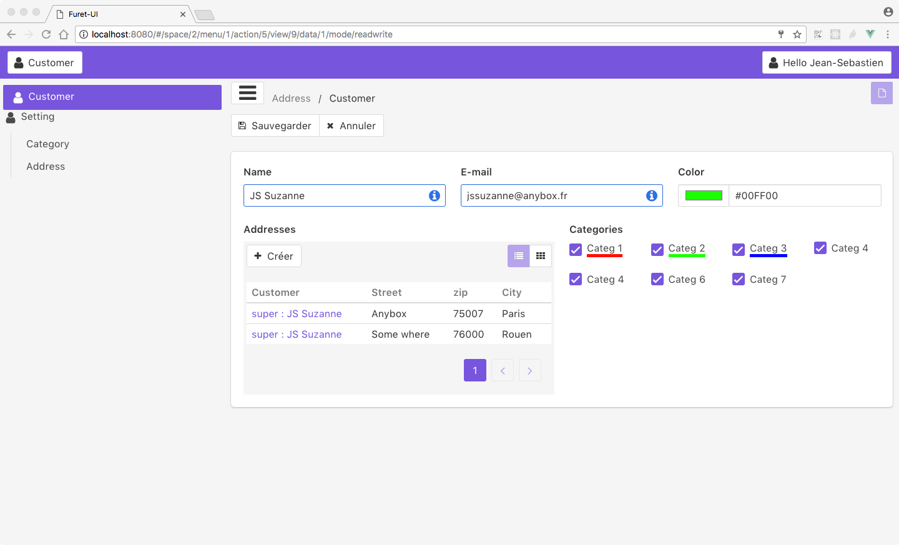
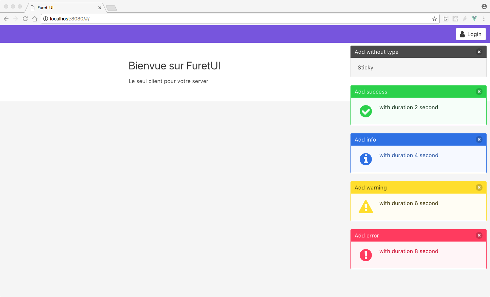
